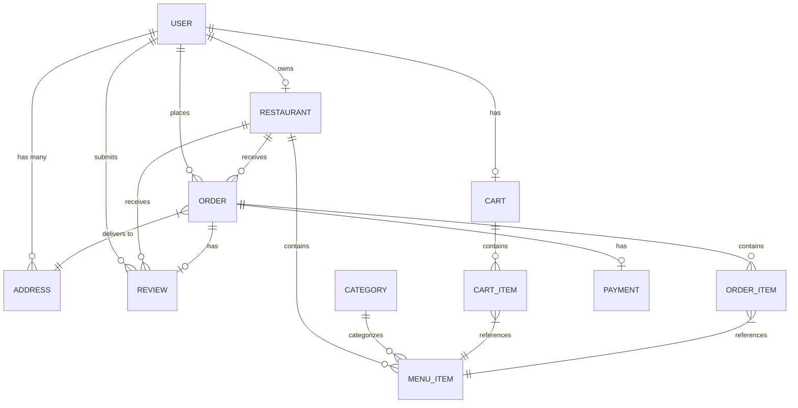

# 07. Entity Relationship Diagram

```mermaid
erDiagram
    USER ||--o{ ADDRESS : "has many"
    USER ||--o{ ORDER : "places"
    USER ||--o{ REVIEW : "submits"
    USER ||--o| RESTAURANT : "owns"
    USER ||--o| CART : "has"

    RESTAURANT ||--o{ MENU_ITEM : "contains"
    RESTAURANT ||--o{ ORDER : "receives"
    RESTAURANT ||--o{ REVIEW : "receives"

    CATEGORY ||--o{ MENU_ITEM : "categorizes"

    CART ||--o{ CART_ITEM : "contains"
    CART_ITEM }|--|| MENU_ITEM : "references"

    ORDER ||--o{ ORDER_ITEM : "contains"
    ORDER_ITEM }|--|| MENU_ITEM : "references"
    ORDER ||--o| PAYMENT : "has"
    ORDER ||--o| REVIEW : "has"
    ORDER }|--|| ADDRESS : "delivers to"
```
